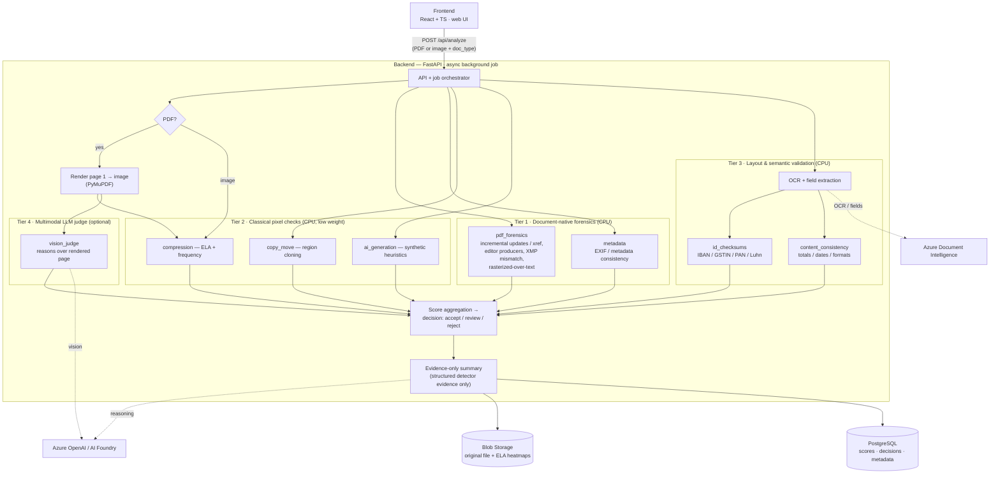

# DocuGuard AI TamperLens

Detects document tampering and AI-generated forgery for banking / KYC / claims
workflows and produces an explainable, structured risk decision. Accepts both
**PDFs and images**, and runs entirely on CPU + managed Azure services (no GPU).

## How it works

Classical pixel forensics (ELA, copy-move, noise) target camera photos and are
blind to cleanly-edited or AI-generated *digital documents*, where genuine and
forged files both look "clean". DocuGuard instead detects fraud by **document
provenance, identifier validity, and multimodal reasoning** — with classical
pixel checks kept only as a low-weight supporting signal.

## Architecture



### Pipeline (text view)

```
Frontend (React + TS, web UI)
        │  POST /api/analyze (PDF or image + doc_type)
        ▼
Backend (FastAPI, async background job)
  │
  │  For PDFs, page 1 is rendered to an image (PyMuPDF) so pixel
  │  detectors still apply; PDF/OCR detectors run on the raw file.
  │
  ├─ Tier 1 — Document-native forensics (CPU)
  │    • pdf_forensics — incremental updates / xref, editor producers,
  │                      XMP metadata mismatch, rasterized-over-text  (pikepdf, PyMuPDF)
  │    • metadata      — EXIF / metadata consistency                  (Pillow, exifread)
  │
  ├─ Tier 2 — Classical pixel checks (CPU, low weight)
  │    • compression   — ELA + frequency analysis → heatmap artifact  (Pillow, NumPy)
  │    • copy_move     — region cloning / duplication                 (OpenCV ORB)
  │    • ai_generation — synthetic-image heuristics
  │
  ├─ Tier 3 — Layout & semantic validation (CPU)
  │    • OCR + field extraction                                       (Azure Document Intelligence)
  │    • id_checksums  — IBAN (mod-97), GSTIN, PAN, card (Luhn)
  │    • content_consistency — cross-field totals / dates / formats
  │
  ├─ Tier 4 — Multimodal LLM judge (optional)
  │    • vision_judge  — vision model reasons over the rendered page  (Azure OpenAI / Foundry)
  │
  ├─ Score aggregation → decision (accept / review / reject)
  └─ Evidence-only summary                                           (Azure AI Foundry / Azure OpenAI)
        │
        ├─ Blob Storage  → original file + ELA heatmap artifacts
        └─ PostgreSQL    → analysis metadata, scores, decisions
```

### Scoring

Each detector returns a 0–1 score. The aggregator combines them with weights that
favour the reliable provenance / structured / vision signals over classical
pixel heuristics:

| Detector              | Weight |
| --------------------- | -----: |
| pdf_forensics         |  0.22  |
| vision_judge          |  0.22  |
| id_checksums          |  0.20  |
| content_consistency   |  0.12  |
| compression_ela       |  0.12  |
| copy_move             |  0.06  |
| metadata              |  0.04  |
| ai_generation         |  0.02  |

Combined score → decision: `< 0.4` accept, `0.4–0.7` review, `≥ 0.7` reject.

The summary LLM never sees the raw document — it only explains the structured
detector evidence. When Document Intelligence / Foundry are not configured, the
app runs fully locally (local file storage + SQLite + deterministic rule-based
summary), and the vision judge degrades to a neutral score.

## Run it on your own machine

### Prerequisites
- **Git**
- **Python 3.11+**
- **Node.js 18+** and npm
- **Docker Desktop** (optional — only for the one-command Docker path)
- Azure services are **optional**: the app runs fully locally without them
  (local file storage + SQLite + deterministic rule-based summary).

### 1. Fork & clone
Fork the repo to your own GitHub account using the **Fork** button, then clone
your fork (replace `<your-username>`):
```powershell
git clone https://github.com/<your-username>/DocuGuard-AI-TamperLens.git
cd DocuGuard-AI-TamperLens
```

### 2. Configure (optional)
To enable the Azure-backed features, copy the env template and fill in values
(see [Configuration](#configuration)). Skip this step to run fully local:
```powershell
copy backend\.env.example backend\.env
```

### 3. Run
Use either the manual setup below or the one-command Docker path.

## Run locally (no Azure required)

Backend:
```powershell
cd backend
python -m venv .venv
.\.venv\Scripts\python.exe -m pip install -r requirements.txt
.\.venv\Scripts\python.exe -m uvicorn app.main:app --reload --port 8000
```

Frontend:
```powershell
cd frontend
npm install
npm run dev
```
Open http://localhost:5173 (Vite proxies `/api` to the backend).

### Or with Docker
```powershell
docker compose up --build
```
Open http://localhost:8080

## Configuration

Copy `backend/.env.example` to `backend/.env` and fill in optional Azure services:
- `BLOB_ACCOUNT_URL` — Azure Blob Storage (managed identity) for artifacts
- `DATABASE_URL` — Postgres connection string for production
- `DOCINTEL_ENDPOINT` — Azure Document Intelligence for OCR / field extraction
- `FOUNDRY_ENDPOINT` + `FOUNDRY_DEPLOYMENT` — Azure AI Foundry / Azure OpenAI model
  for the evidence summary
- `ENABLE_VISION_JUDGE` — toggle the Tier 4 multimodal vision judge (requires a
  vision-capable `FOUNDRY_DEPLOYMENT`, e.g. `gpt-4.1-mini`)

All Azure services prefer **managed identity**; keys are dev fallbacks only.

## API

- `POST /api/analyze` — multipart `file` (PDF or image) + `doc_type` → `{ analysis_id, status }` (202)
- `GET  /api/analyze/{id}` — status, per-detector scores, tamper score, decision, LLM summary
- `GET  /api/health` — service + integration status

## Deploy to Azure

Live PoC runs on **Azure Container Apps** in resource group `docuguard`
(region `centralindia`):
- Backend `docuguard-api` (internal ingress) + frontend `docuguard` (external)
- Images built in **Azure Container Registry** `docuguardksacr` via `az acr build`
- **Azure OpenAI** `docuguardks-openai` (`gpt-4.1-mini`, vision-capable) and
  **Azure Document Intelligence** `docuguardks-docintel` (prebuilt-layout)
- **Storage** `docuguardksstor` for artifacts
- Managed-identity roles: Storage Blob Data Contributor, Cognitive Services
  OpenAI User, Cognitive Services User (Document Intelligence)
- Observability via Application Insights + Log Analytics

Build & deploy a new backend revision:
```powershell
az acr build --registry docuguardksacr --image docuguard-backend:vN ./backend
az containerapp update -n docuguard-api -g docuguard `
  --image docuguardksacr.azurecr.io/docuguard-backend:vN
```
